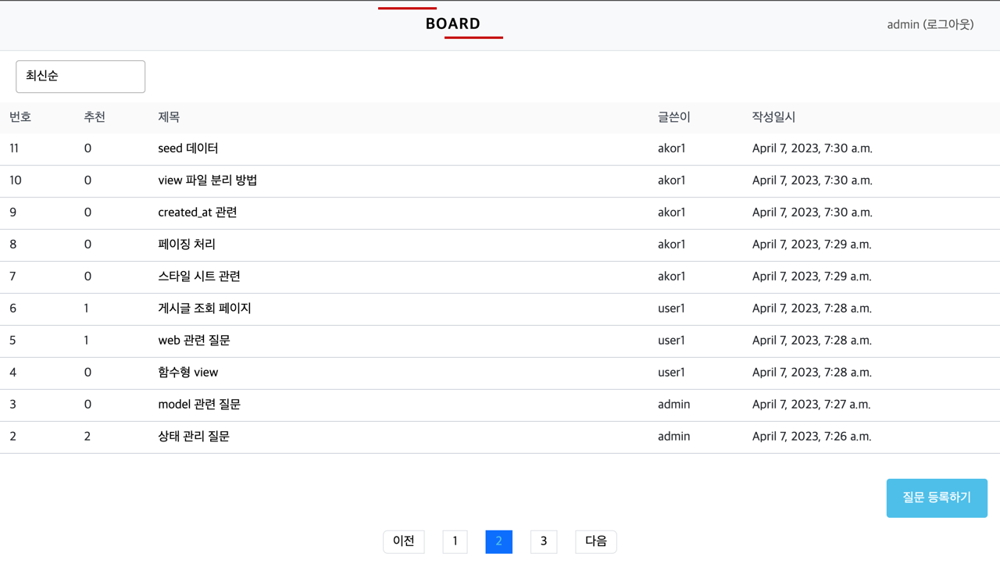
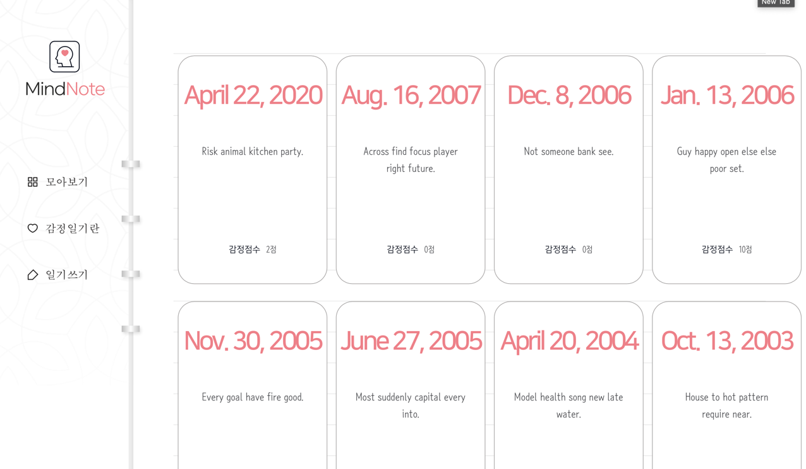
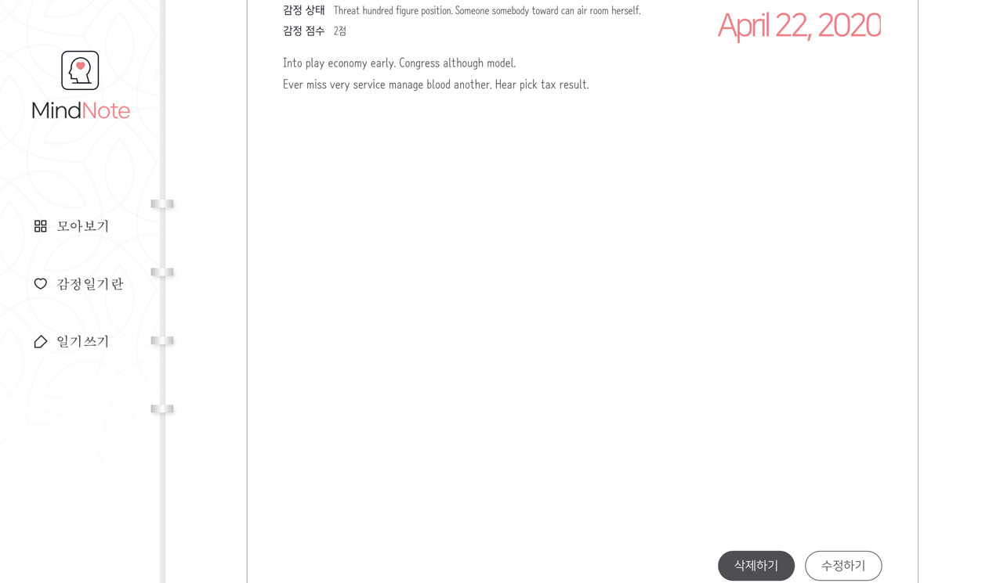
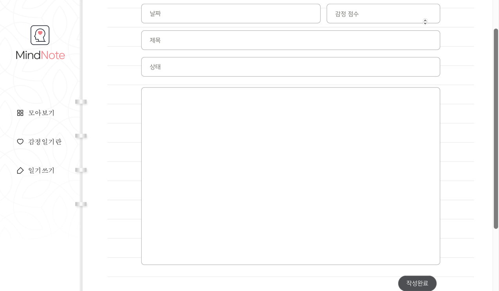
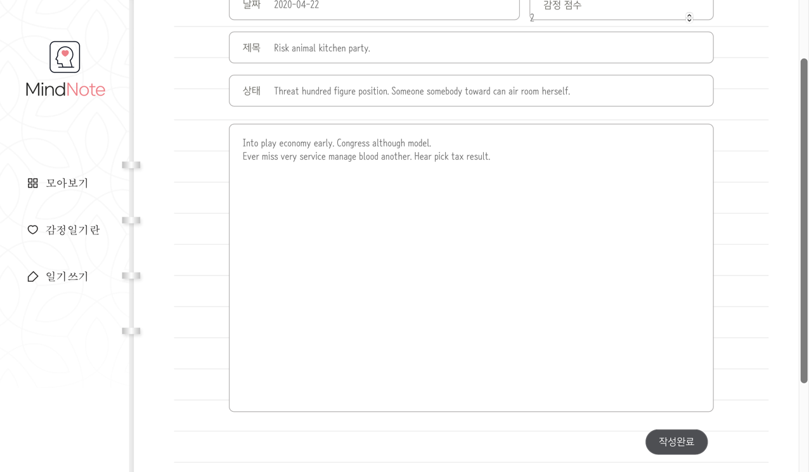
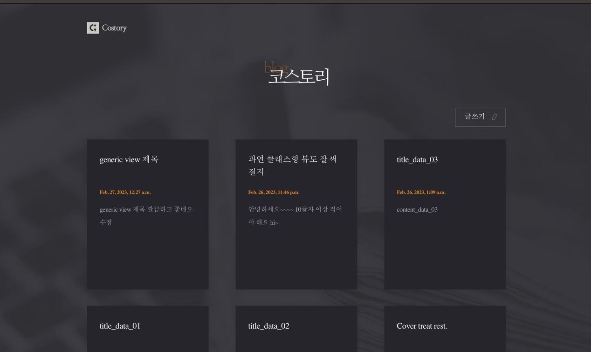

# 구현한 Django 웹 애플리케이션 리스트

## Python Board 구현
> 함수형 View 를 배우면서 만든 django 게시판

### 개발환경
- Python3.9
- Django4.1
- MySQL
- HTML, SCSS, Bootstrap
- jQuery

### [기능 정리 링크](doit/mysite/README.md)

## Mindnote(감정 일기)
> 

### 개발환경

### [기능 정리 링크](codeit-django/mindnote/README.md)

## Costory(블로그)
> 함수형, 클래스형, 제네릭형 View를 모두 경험해볼 수 있었던 블로그 프로젝트

### 개발환경
- Python3.8
- Django4.2
- HTML, CSS, Bootsrap
- Python Black

### [기능 정리 링크](codeit-django/costory/README.md)

## 에어비앤비 클론코딩(BackEnd)
> REST API를 배우면서 만든 airbnb API

### 개발환경
- Python3.11
- Django4.1
- PostgreSQL
- Python Black
- Poetry

### [기능 정리 링크](airbnb-clone-backend/README.md)
